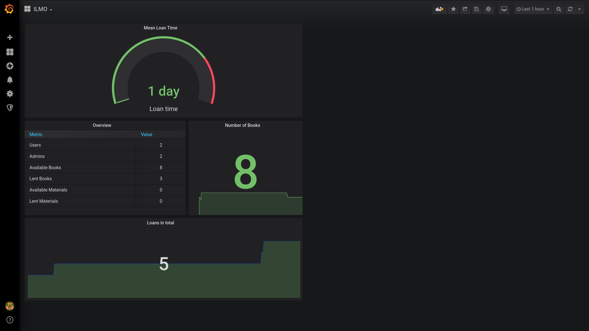

Monitoring
==========

ILMO should, like every other software, be easy to monitor. Therefore a basic metrics are exposed to `https://example.com/metrics_json/`.
The data is encoded in JSON format and is therefore suitable to bea read by humans and it is easy to use it as data source for further processing.

Exposed Metrics
---------------

.. code::

   users: number of users (all roles combined)
   loan: number of loans 
   loan_length_mean: Mean loan length in days
   admin_num: Number of admins
   lent_books_num: number of books that are lent
   avail_books_num: number of books that are available
   lent_material_num: number of materials are lent
   avail_material_num: number of materials are available

Example workflow
----------------

To use the exposed metrics you will usually need a time series database and a visualization tool.

As time series database we will utilize InfluxDB, the visualization tool will be Grafana.

InfluxDB and Telegraf
^^^^^^^^^^^^^^^^^^^^^

First we install InfluxDB (e.g. with docker, be aware of the security risks!).

.. code::

   # Pull the image
   $ sudo docker pull influxdb

   # Start influxdb
   $ sudo docker run -d -p 8086:8086 -v influxdb:/var/lib/influxdb --name influxdb influxdb

   # Start influxdb console
   $ docker exec -it influxdb influx
   Connected to http://localhost:8086 version 1.8.3
   InfluxDB shell version: 1.8.3
   > create database monitoring
   > create user "telegraf" with password 'mypassword'
   > grant all on monitoring to telegraf

.. note::
   When creating the user telegraf check the double and single quotes for username an password.

Now install telegraf and configure `etc/telegraf/telegraf.conf`. Modify the domain and your password for the InfluxDB database. 

.. literalinclude:: example.telegraf.conf
    :linenos:
    :language: python

Graphana
^^^^^^^^

Now we can simply use the InfluxDB as data source in Grafana and configure until you have
beautiful plots!

